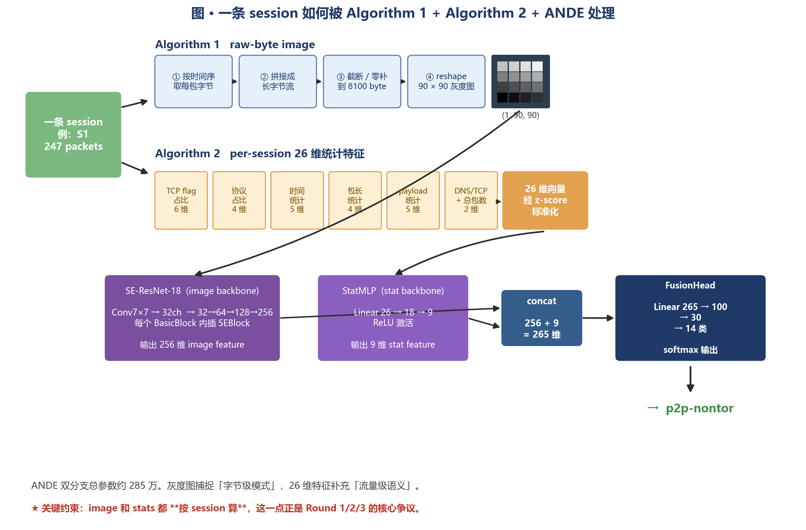
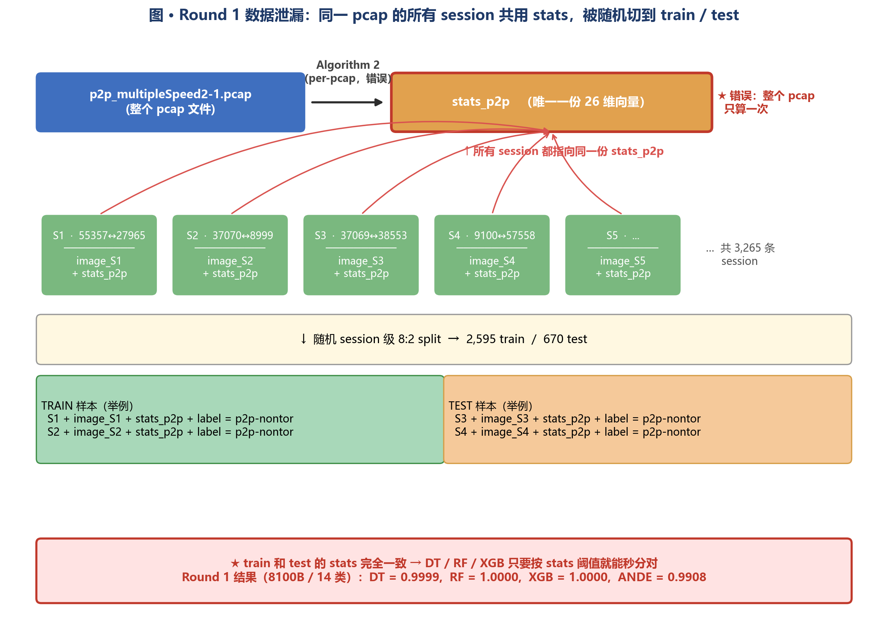
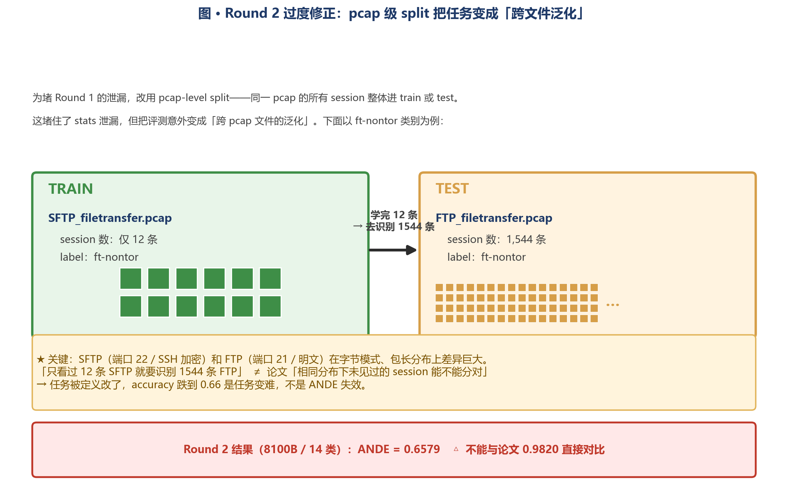
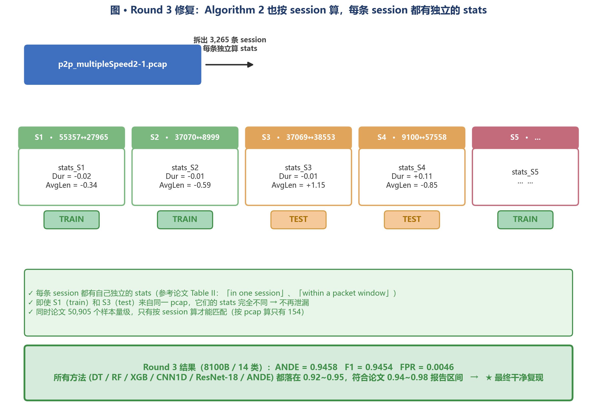
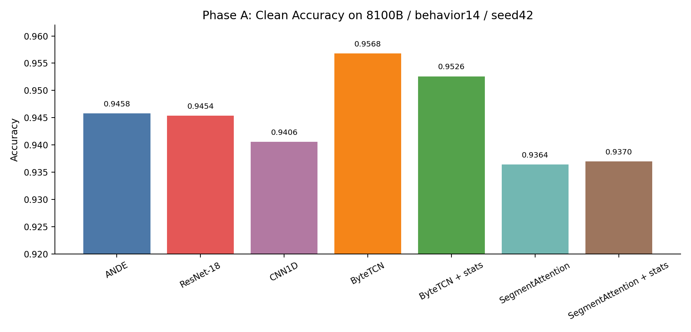
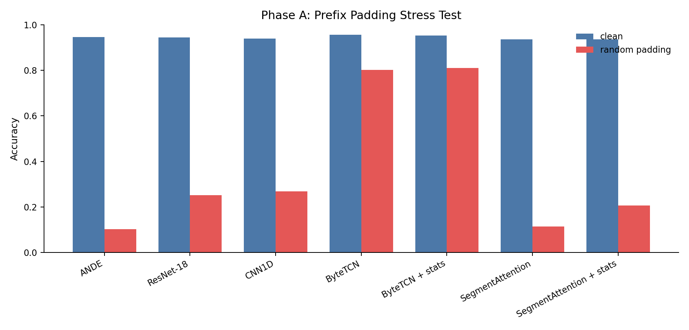
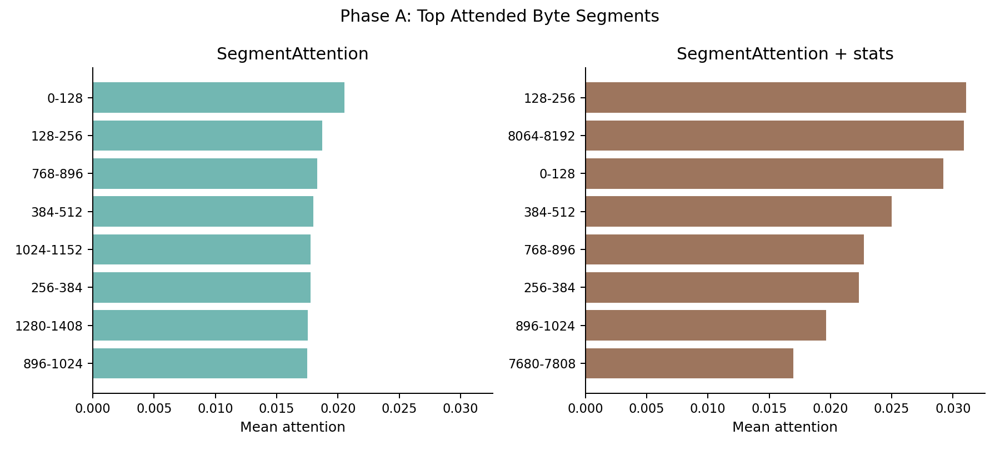
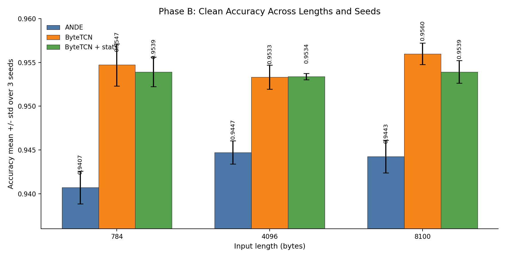
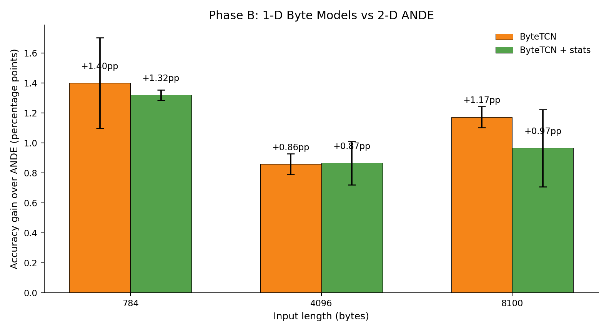
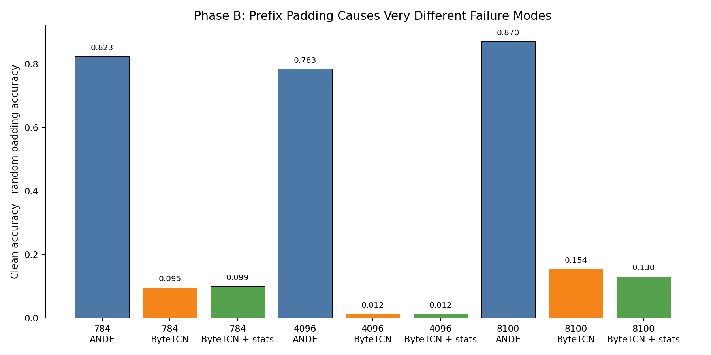

# ANDE 复现与扩展实验过程

> 论文：Deng et al., "ANDE: Detect the Anonymity Web Traffic With Comprehensive Model", IEEE TNSM 2024  
> 论文原文：`paper/full.md`  
> 项目目录：`D:\01_Projects\ANDE-Reproduction`  
> 主要实验机：AutoDL / RTX 5090 32GB  
> 时间线：2026-05-07 至 2026-05-12  

这份文档把本项目的复现、错误排查、方法修正、扩展实验和结果同步情况合并成一个完整实验过程。目标是让后来的人不需要翻多份零散记录，也能知道：

1. 我们研究了什么问题。
2. 原论文 ANDE 的输入、预处理和模型结构是什么。
3. 我们三轮复现实验分别做了什么，为什么前两轮不能作为最终结果。
4. 最终干净复现结果是多少，和论文差多少。
5. 后续扩展实验为什么做、怎么做、得到了什么结论。
6. 哪些结果文件、日志、模型输出已经从实验机拿回本地。

---

## 0. 总结

本项目最终得到两个层面的结论。

第一，ANDE 论文复现本身：

```text
任务：Behavior14，14 类用户行为分类
输入长度：8100 bytes
模型：ANDE
论文 accuracy：0.9820
我们最终干净复现 accuracy：0.9458
差距：约 3.6 个百分点
```

这个结果低于论文，但已经落在同一量级。更重要的是，我们排除了前两轮复现中的方法论错误，确认最终使用的是：

```text
image 单位：session
stats 单位：session
split 单位：session
```

第二，围绕原论文方法做了三个扩展问题：

| 研究问题 | 实验设计 | 主要结论 |
| --- | --- | --- |
| 字节强行排成方阵是否合理？ | 用 1-D ByteTCN 直接处理字节序列，对比 ANDE 的 2-D reshape 输入 | ByteTCN 在三种长度、三组 seed 上都超过 ANDE |
| 固定长度 784 / 4096 / 8100 是否太朴素？ | 做 SegmentAttention，让模型关注连续字节段 | 初版 attention 没超过 ANDE，但注意力集中在若干连续 byte range，说明方向有信号 |
| 攻击者通过 padding / delay / shaping 是否能规避检测？ | 对测试输入做 random padding、random delay、traffic shaping proxy | prefix padding 对 ANDE 打击极大；delay/shaping proxy 几乎无影响 |

---

## 1. 研究对象：ANDE 要解决什么问题

ANDE 的任务是匿名网络流量检测。模型输入是一条网络连接 session，输出它属于哪类流量。

本项目复现了两个任务：

| 任务 | 类别数 | 说明 |
| --- | ---: | --- |
| Binary2 | 2 | Tor / NonTor 二分类 |
| Behavior14 | 14 | 7 种行为，每种再区分 Tor / NonTor |

Behavior14 的 7 种行为是：

```text
browsing
chat
email
ft
p2p
streaming
voip
```

14 类标签顺序在代码中定义为：

```text
browsing-nontor = 0
browsing-tor    = 1
chat-nontor     = 2
chat-tor        = 3
email-nontor    = 4
email-tor       = 5
ft-nontor       = 6
ft-tor          = 7
p2p-nontor      = 8
p2p-tor         = 9
streaming-nontor = 10
streaming-tor    = 11
voip-nontor      = 12
voip-tor         = 13
```

相关代码：

- `src/ande/data/labels.py`
- `src/ande/data/preprocess_raw.py`
- `src/ande/data/preprocess_stats.py`
- `src/ande/data/dataset.py`

---

## 2. 一个样本到底是什么：pcap、packet、session

本项目最容易出错的地方，是把 pcap 和 session 的单位搞混。

### 2.1 pcap

pcap 是原始抓包文件。一个 pcap 里面包含很多 packet，也可能包含很多条连接。

例如：

```text
p2p_multipleSpeed2-1.pcap
```

这个 pcap 的标签是：

```text
p2p-nontor
```

在最终 joined manifest 中，它产生了：

```text
3265 条有效 session
```

### 2.2 packet

packet 是 pcap 里的一个网络包。一个 packet 通常包含：

```text
时间戳
源 IP / 源端口
目的 IP / 目的端口
协议
长度
payload
TCP flag 等
```

### 2.3 session

session 是按五元组从 pcap 里切出来的一条连接。

五元组是：

```text
源 IP
源端口
目的 IP
目的端口
协议
```

真实 session id 例子：

```text
p2p_multipleSpeed2-1__10.152.152.11_55357_103.52.253.34_27965_6
```

它表示：

```text
pcap：p2p_multipleSpeed2-1.pcap
源地址：10.152.152.11:55357
目的地址：103.52.253.34:27965
协议号：6，即 TCP
标签：p2p-nontor
```

模型训练时，一个样本是 session，不是整个 pcap。

所以最终一个样本应该长这样：

```text
session_id = p2p_multipleSpeed2-1__10.152.152.11_55357_103.52.253.34_27965_6
image      = 这条 session 的 raw-byte image
stats      = 这条 session 的 26 维统计特征
label      = p2p-nontor
```

---

## 3. 论文方法：Algorithm 1、Algorithm 2、ANDE

ANDE 的输入有两路。

第一路是 raw-byte image。  
第二路是 26 维 statistical features。  
两路特征最后融合分类。



### 3.1 Algorithm 1：Raw Data Preprocessing

Algorithm 1 把原始 pcap 里的每条 session 转成固定长度的字节图像。

对一条 session，例如：

```text
p2p_multipleSpeed2-1__10.152.152.11_55357_103.52.253.34_27965_6
```

处理步骤是：

```text
1. 读取该 session 内的 packet
2. 取 packet bytes
3. 按时间顺序拼接 bytes
4. 截断或补齐到固定长度
5. reshape 成灰度图
```

论文使用三个长度：

| bytes | image shape |
| ---: | --- |
| 784 | 28 x 28 |
| 4096 | 64 x 64 |
| 8100 | 90 x 90 |

所以：

```text
一条 session -> image_784 / image_4096 / image_8100
```

本项目中，Algorithm 1 的 manifest 是：

```text
data/manifest_raw.parquet
```

它的规模：

```text
54,460 sessions
```

### 3.2 Algorithm 2：Statistic Data Preprocessing

Algorithm 2 计算统计特征。关键问题是：统计特征到底应该对 pcap 算，还是对 session 算。

我们最终确认：应该对 session 算。

每条 session 计算 26 个统计特征，包括：

| 特征组 | 例子 |
| --- | --- |
| TCP flag | `Avg_syn_flag`, `Avg_ack_flag`, `Avg_fin_flag`, `Avg_psh_flag` |
| 协议比例 | `Avg_DNS_pkt`, `Avg_TCP_pkt`, `Avg_UDP_pkt`, `Avg_ICMP_pkt` |
| 时间 | `Duration_window_flow`, `Avg_deltas_time`, `Min_deltas_time`, `Max_deltas_time`, `StDev_deltas_time` |
| 长度 | `Avg_Pkts_length`, `Min_Pkts_length`, `Max_Pkts_length`, `StDev_Pkts_length` |
| payload | `Avg_payload`, `Min_payload`, `Max_payload`, `StDev_payload` |
| 数量 | `num_packets` |

本项目中，最终 Algorithm 2 的 manifest 是：

```text
data/manifest_stats.parquet
```

它的规模：

```text
24,995 sessions with stats
```

为什么比 Algorithm 1 少：

```text
Algorithm 1 保留 >= 3 packets 的 session
Algorithm 2 统计特征保留 >= 10 packets 的 session
最终训练集取两者 inner join
```

### 3.3 ANDE 模型

ANDE 结构：

```text
raw-byte image
  -> SE-ResNet-18
  -> 256 维 image feature

26 维 stats
  -> MLP: 26 -> 18 -> 9
  -> 9 维 stats feature

256 + 9 = 265 维 fused feature
  -> MLP: 265 -> 100 -> 30 -> num_classes
```

相关实现：

- `src/ande/models/ande.py`
- `src/ande/train.py`
- `src/ande/evaluate.py`

---

## 4. 数据、环境和产物

### 4.1 数据

最终使用的数据：

| 数据集 | pcap 数 | 体积 |
| --- | ---: | ---: |
| ISCXTor2016 / Tor | 50 | 12.5 GB |
| ISCXTor2016 / NonTor | 44 | 10.6 GB |
| darknet-2020 / tor | 60 | 9.9 GB |
| 合计 | 154 | 33.0 GB |

最终训练数据：

```text
raw sessions：54,460
joined sessions with stats：24,995
train/test split：19,996 / 4,999
```

14 类样本图示：


### 4.2 实验环境

主要实验机：

```text
AutoDL / NVIDIA RTX 5090 32GB
Python 3.12
PyTorch 2.8.0+cu128
```

本地环境：

```text
D:\01_Projects\ANDE-Reproduction
Windows / PowerShell
uv 项目环境
```

### 4.3 已同步回本地的结果

已经从实验机同步回本地的结果包括：

```text
docs/results/
outputs/
docs/figures/
matrix.log
extended_phaseA.log
extended_phaseB.log
pipeline.log
train.log
```

对账结果：

```text
远程 outputs 中 results.json 数量：73
本地 outputs 中 results.json 数量：73
远程 outputs 中 best.pt 数量：31
本地 outputs 中 best.pt 数量：31
docs/results 远程缺失到本地：0
```

没有同步的数据：

```text
raw pcap 数据
缓存目录
.venv
预处理缓存中间文件
```

---

## 5. 三轮复现实验总览

三轮实验的核心差异如下：

| 轮次 | image 单位 | stats 单位 | split 单位 | ANDE 8100 / Behavior14 | 结论 |
| --- | --- | --- | --- | ---: | --- |
| Round 1 | session | pcap | session | 0.9908 | 错，pcap 级 stats 泄漏 |
| Round 2 | session | pcap | pcap | 0.6579 | 不泄漏，但任务变成跨 pcap 文件测试 |
| Round 3 | session | session | session | 0.9458 | 最终复现方案 |

---

## 6. Round 1：per-pcap stats + session split

### 6.1 Round 1 做了什么

Round 1 按论文 Algorithm 2 字面理解：

```text
Algorithm 1：按 session 生成 image
Algorithm 2：按整个原始 pcap 生成 stats
split：按 session 随机划分 train/test
```

具体到：

```text
p2p_multipleSpeed2-1.pcap
```

它有：

```text
3265 条有效 session
```

Round 1 只对整个 pcap 算一次 stats：

```text
stats_p2p_multipleSpeed2_1
```

于是 3265 条 session 都使用同一份 stats：

```text
S1 -> image_S1 + stats_p2p_multipleSpeed2_1 + label=p2p-nontor
S2 -> image_S2 + stats_p2p_multipleSpeed2_1 + label=p2p-nontor
S3 -> image_S3 + stats_p2p_multipleSpeed2_1 + label=p2p-nontor
...
S3265 -> image_S3265 + stats_p2p_multipleSpeed2_1 + label=p2p-nontor
```

### 6.2 Round 1 的 split

seed42 的 session split 中，这个 pcap 的 session 被分成：

```text
train：2595 条 session
test ：670 条 session
```

真实 session 例子：

| split | session_id | image | stats | label |
| --- | --- | --- | --- | --- |
| train | `p2p_multipleSpeed2-1__10.152.152.11_55357_103.52.253.34_27965_6` | 这条 session 自己的 image | `stats_p2p_multipleSpeed2_1` | p2p-nontor |
| train | `p2p_multipleSpeed2-1__10.152.152.11_37070_190.239.206.162_8999_6` | 这条 session 自己的 image | `stats_p2p_multipleSpeed2_1` | p2p-nontor |
| test | `p2p_multipleSpeed2-1__10.152.152.11_37069_186.115.246.60_38553_6` | 这条 session 自己的 image | `stats_p2p_multipleSpeed2_1` | p2p-nontor |
| test | `p2p_multipleSpeed2-1__10.152.152.11_9100_182.185.113.123_57558_17` | 这条 session 自己的 image | `stats_p2p_multipleSpeed2_1` | p2p-nontor |

### 6.3 Round 1 为什么错

测试集中的 session image 是新的，但 stats 不是新的。

```text
训练集里 2595 条 session 带着 stats_p2p_multipleSpeed2_1
测试集里 670 条 session 也带着同一个 stats_p2p_multipleSpeed2_1
```

这意味着测试样本的一部分输入特征，在训练集中已经以完全相同的形式出现过很多次。

所以 Round 1 的评测不干净。



### 6.4 Round 1 结果

Round 1 的结果异常高。

`8100B / Behavior14`：

| Method | Round 1 accuracy |
| --- | ---: |
| DT | 0.9999 |
| RF | 1.0000 |
| XGB | 1.0000 |
| CNN1D | 0.9467 |
| ResNet-18 | 0.9567 |
| ANDE-no-SE | 0.9916 |
| ANDE | 0.9908±0.0018 |

这里最关键的异常不是 ANDE 高，而是 DT / RF / XGB 几乎 1.0。传统模型只看 stats 也能接近满分，说明 stats 本身已经暴露了 pcap 级信息。

Round 1 不能作为最终复现结果。

---

## 7. Round 2：per-pcap stats + pcap-level split

### 7.1 Round 2 做了什么

为了解决 Round 1 的泄漏，我们改成：

```text
Algorithm 1：按 session 生成 image
Algorithm 2：仍然按整个 pcap 生成 stats
split：按 pcap 文件划分 train/test
```

这次同一个 pcap 不会同时出现在 train 和 test。

### 7.2 p2p-nontor 的具体例子

Round 2 中，`p2p-nontor` 相关 pcap 被切成：

| pcap | session 数 | Round 2 split |
| --- | ---: | --- |
| `p2p_multipleSpeed.pcap` | 3265 | train |
| `p2p_multipleSpeed2-1.pcap` | 3265 | train |
| `p2p_vuze.pcap` | 395 | train |
| `p2p_vuze2-1.pcap` | 395 | test |

训练集中的 session 例子：

```text
p2p_multipleSpeed2-1__10.152.152.11_55357_103.52.253.34_27965_6
p2p_multipleSpeed2-1__10.152.152.11_37070_190.239.206.162_8999_6
```

测试集中的 `p2p-nontor` session 来自另一个 pcap：

```text
p2p_vuze2-1__10.152.152.11_46670_125.164.29.163_39953_6
p2p_vuze2-1__10.152.152.11_40912_217.81.12.186_51413_6
```

### 7.3 ft-nontor 的具体例子

`ft-nontor` 更能说明 Round 2 的问题：

| pcap | session 数 | Round 2 split |
| --- | ---: | --- |
| `SFTP_filetransfer.pcap` | 12 | train |
| `FTP_filetransfer.pcap` | 1544 | test |

训练 session：

```text
SFTP_filetransfer__10.152.152.11_59118_75.101.155.12_22_6
SFTP_filetransfer__10.152.152.11_41062_75.101.155.12_22_6
```

测试 session：

```text
FTP_filetransfer__10.152.152.11_34270_75.101.155.12_21_6
FTP_filetransfer__10.152.152.11_34273_75.101.155.12_21_6
```

这里不是简单的“训练 session 和测试 session 不同”，而是训练只看到 `SFTP_filetransfer.pcap` 的 12 条 session，测试却要判断 `FTP_filetransfer.pcap` 的 1544 条 session。

### 7.4 Round 2 为什么不能作为最终复现

Round 2 确实堵住了 Round 1 的泄漏：

```text
train/test 不再共享同一个 pcap 级 stats
```

但评测任务变了：

```text
原论文更接近：同一批数据中，没见过的 session 能不能分类正确
Round 2 变成：来自没见过的 pcap 文件的 session 能不能分类正确
```

这是跨 pcap 文件测试，比原论文主评测更严格。



### 7.5 Round 2 结果

`8100B / Behavior14`：

| Method | Round 2 accuracy |
| --- | ---: |
| DT | 0.7404 |
| RF | 0.7481 |
| XGB | 0.6157 |
| CNN1D | 0.5559 |
| ResNet-18 | 0.5767 |
| ANDE-no-SE | 0.6744 |
| ANDE | 0.6579 |

Round 2 有研究价值，可以作为跨 pcap 文件泛化测试，但不能拿来和论文主表直接对比。

---

## 8. Round 3：per-session stats + session split

### 8.1 Round 3 做了什么

Round 3 重新解释 Algorithm 2：

```text
Algorithm 1：按 session 生成 image
Algorithm 2：按 session 生成 stats
split：按 session 随机划分 train/test
```

这意味着每条 session 的输入是：

```text
S1 -> image_S1 + stats_S1 + label
S2 -> image_S2 + stats_S2 + label
S3 -> image_S3 + stats_S3 + label
```

### 8.2 为什么确定 Algorithm 2 应该按 session 算

依据有三个：

1. 论文 Table II 中多处写的是 `in one session`、`within a packet window`。
2. 论文报告的样本数量是五万级，只有 session 级别才可能达到这个数量。
3. Algorithm 1 中有保存 session 到文件夹的步骤，Algorithm 2 里的 `*.pcap` 更合理的解释是 Algorithm 1 输出的 session pcap，而不是原始大 pcap。

### 8.3 Round 3 的真实 session 特征

仍然看 `p2p_multipleSpeed2-1.pcap`。

它的 3265 条 session 在 seed42 split 中分成：

```text
train：2595
test ：670
```

但这一次，每条 session 都有自己的 stats。

数值是标准化后的特征值：

| split | session_id | Duration_window_flow | Avg_Pkts_length | Avg_payload | stats 来源 |
| --- | --- | ---: | ---: | ---: | --- |
| train | `p2p_multipleSpeed2-1__10.152.152.11_55357_103.52.253.34_27965_6` | -0.0211 | -0.3372 | -0.3372 | 只统计这条 session |
| train | `p2p_multipleSpeed2-1__10.152.152.11_37070_190.239.206.162_8999_6` | -0.0149 | -0.5858 | -0.5874 | 只统计这条 session |
| test | `p2p_multipleSpeed2-1__10.152.152.11_37069_186.115.246.60_38553_6` | -0.0132 | 1.1500 | 1.1540 | 只统计这条 session |
| test | `p2p_multipleSpeed2-1__10.152.152.11_9100_182.185.113.123_57558_17` | 0.1053 | -0.8545 | -0.8056 | 只统计这条 session |

Round 1 和 Round 3 的关键区别：

```text
Round 1：同一个 pcap 内的 session 共用 stats_pcap
Round 3：同一个 pcap 内的 session 各自使用 stats_session
```



### 8.4 Round 3 结果

`8100B / Behavior14`：

| Method | Round 3 accuracy |
| --- | ---: |
| DT | 0.9220 |
| RF | 0.9408 |
| XGB | 0.9436 |
| CNN1D | 0.9406 |
| ResNet-18 | 0.9454 |
| ANDE-no-SE | 0.9486 |
| ANDE | 0.9458 |

Round 3 是最终干净复现口径。

---

## 9. 三轮完整结果

三轮完整结果已经从历史 git commit 和当前最终结果中恢复，文件在：

```text
docs/results/round_history/
```

完整 accuracy 表：

```text
docs/results/round_history/three_rounds_complete_accuracy.md
```

完整 precision / recall / F1 / FPR：

```text
docs/results/round_history/all_rounds_results_summary.csv
```

### 9.1 Behavior14

| size | Method | Round 1 泄漏版 | Round 2 pcap split | Round 3 最终版 |
| ---: | --- | ---: | ---: | ---: |
| 784 | DT | 0.9999 | 0.7404 | 0.9220 |
| 784 | RF | 1.0000 | 0.7481 | 0.9408 |
| 784 | XGB | 1.0000 | 0.6157 | 0.9436 |
| 784 | CNN1D | 0.9527 | 0.5618 | 0.9440 |
| 784 | ResNet-18 | 0.9525 | 0.5663 | 0.9392 |
| 784 | ANDE-no-SE | 0.9905 | 0.5993 | 0.9352 |
| 784 | ANDE | 0.9900 | 0.6216 | 0.9420 |
| 4096 | DT | 0.9999 | 0.7404 | 0.9220 |
| 4096 | RF | 1.0000 | 0.7481 | 0.9408 |
| 4096 | XGB | 1.0000 | 0.6157 | 0.9436 |
| 4096 | CNN1D | 0.9535 | 0.5580 | 0.9438 |
| 4096 | ResNet-18 | 0.9566 | 0.5831 | 0.9458 |
| 4096 | ANDE-no-SE | 0.9908 | 0.6113 | 0.9426 |
| 4096 | ANDE | 0.9892 | 0.7032 | 0.9464 |
| 8100 | DT | 0.9999 | 0.7404 | 0.9220 |
| 8100 | RF | 1.0000 | 0.7481 | 0.9408 |
| 8100 | XGB | 1.0000 | 0.6157 | 0.9436 |
| 8100 | CNN1D | 0.9467 | 0.5559 | 0.9406 |
| 8100 | ResNet-18 | 0.9567 | 0.5767 | 0.9454 |
| 8100 | ANDE-no-SE | 0.9916 | 0.6744 | 0.9486 |
| 8100 | ANDE | 0.9908±0.0018 | 0.6579 | 0.9458 |

### 9.2 Binary2

| size | Method | Round 1 泄漏版 | Round 2 pcap split | Round 3 最终版 |
| ---: | --- | ---: | ---: | ---: |
| 784 | DT | 1.0000 | 1.0000 | 0.9950 |
| 784 | RF | 1.0000 | 1.0000 | 0.9970 |
| 784 | XGB | 1.0000 | 1.0000 | 0.9984 |
| 784 | CNN1D | 0.9993 | 0.9986 | 0.9994 |
| 784 | ResNet-18 | 0.9983 | 0.9967 | 0.9966 |
| 784 | ANDE-no-SE | 0.9992 | 0.9986 | 0.9970 |
| 784 | ANDE | 0.9996 | 0.9989 | 0.9972 |
| 4096 | DT | 1.0000 | 1.0000 | 0.9950 |
| 4096 | RF | 1.0000 | 1.0000 | 0.9970 |
| 4096 | XGB | 1.0000 | 1.0000 | 0.9984 |
| 4096 | CNN1D | 0.9985 | 0.9968 | 0.9968 |
| 4096 | ResNet-18 | 0.9983 | 0.9953 | 0.9964 |
| 4096 | ANDE-no-SE | 0.9987 | 0.9967 | 0.9956 |
| 4096 | ANDE | 0.9990 | 0.9991 | 0.9966 |
| 8100 | DT | 1.0000 | 1.0000 | 0.9950 |
| 8100 | RF | 1.0000 | 1.0000 | 0.9970 |
| 8100 | XGB | 1.0000 | 1.0000 | 0.9984 |
| 8100 | CNN1D | 0.9976 | 0.9956 | 0.9944 |
| 8100 | ResNet-18 | 0.9990 | 0.9943 | 0.9966 |
| 8100 | ANDE-no-SE | 0.9992 | 0.9977 | 0.9970 |
| 8100 | ANDE | 0.9992 | 0.9961 | 0.9966 |

---

## 10. 工程实现：per-session stats 为什么需要流式计算

Round 3 确定要按 session 计算 stats 后，遇到工程问题。

初版实现：

```text
dict[session_id] = list_of_packets
最后遍历每个 session 的 packet list 算统计特征
```

这个方法在小 pcap 上可以跑，但在大 pcap 上会爆内存。

问题：

```text
某些 pcap 有上千万 packet
scapy packet 对象很重
如果每个 session 都保存完整 packet list，worker RSS 可到 12GB
payload 计算如果反复 bytes(pkt[TCP].payload)，速度也很慢
```

修复方案：

```text
读到一个 packet
  -> 根据五元组找到所属 session
  -> 立即更新该 session 的统计累积器
  -> 不保存完整 packet 对象
```

实现：

```text
src/ande/data/preprocess_stats.py
SessionAcc
Welford 在线均值/方差
payload length 用 IP/TCP header length 算术计算
```

效果：

```text
原始实现：大 pcap 跑 3 小时仍未完成
修复后：64 workers 处理 31GB pcap，约 12 分钟完成
```

---

## 11. 最终 42 组复现矩阵

Round 3 后，跑完整复现矩阵：

```text
sizes：784 / 4096 / 8100
tasks：binary2 / behavior14
methods：DT / RF / XGB / CNN1D / ResNet-18 / ANDE-no-SE / ANDE
seed：42
总实验数：3 x 2 x 7 = 42
```

结果文件：

```text
docs/results/results_long.csv
docs/results/matrix_summary.json
docs/results/table_behavior14.md
docs/results/table_binary2.md
outputs/*/results.json
```

总览图：


### 11.1 Behavior14 / 8100B

| Method | Paper | Ours | Gap |
| --- | ---: | ---: | ---: |
| DT | 0.9482 | 0.9220 | -0.0262 |
| RF | 0.9599 | 0.9408 | -0.0191 |
| XGB | 0.9605 | 0.9436 | -0.0169 |
| CNN1D | 0.9609 | 0.9406 | -0.0203 |
| ResNet-18 | 0.9773 | 0.9454 | -0.0319 |
| ANDE-no-SE | 0.9726 | 0.9486 | -0.0240 |
| ANDE | 0.9820 | 0.9458 | -0.0362 |

训练曲线：


混淆矩阵：


各类别指标：


### 11.2 Binary2 / 8100B

| Method | accuracy | F1 | FPR |
| --- | ---: | ---: | ---: |
| XGB | 0.9984 | 0.9984 | 0.0069 |
| ANDE-no-SE | 0.9970 | 0.9970 | 0.0096 |
| RF | 0.9970 | 0.9970 | 0.0136 |
| ANDE | 0.9966 | 0.9966 | 0.0108 |
| ResNet-18 | 0.9966 | 0.9966 | 0.0118 |
| DT | 0.9950 | 0.9950 | 0.0167 |
| CNN1D | 0.9944 | 0.9944 | 0.0230 |

Binary2 任务非常容易，因此不能充分暴露 Round 1 / Round 2 的问题。真正能区分方法论是否正确的是 Behavior14。

---

## 12. 扩展实验：我们继续研究了什么问题

完成干净复现后，我们继续研究三个问题。

### 12.1 问题 1：字节排成二维方阵是否合理

ANDE 把一维字节序列 reshape 成二维图像：

```text
8100 bytes -> 90 x 90 image
```

但原始字节是有顺序的一维序列。reshape 后会引入人为邻接关系。

例如：

```text
原始序列：byte[0], byte[1], ..., byte[89], byte[90], ...
90 x 90 图像：byte[89] 在第一行末尾，byte[90] 在第二行开头
```

二维卷积还会看到上下方向的邻接关系，例如：

```text
byte[0] 与 byte[90]
byte[1] 与 byte[91]
```

这个上下关系不是协议天然结构，而是 reshape 产生的。

所以我们实现了 1-D 模型：

```text
src/ande/models/byte_sequence.py
ByteTCN
ByteSegmentAttention
```

ByteTCN 是 dilated residual 1-D CNN，直接处理 flatten 后的字节序列。

### 12.2 问题 2：固定长度 784 / 4096 / 8100 是否太朴素

论文只比较三个固定长度：

```text
784
4096
8100
```

固定长度等价于默认前 N 个字节最重要。但不同 session 的有效信息可能出现在不同位置。

因此我们实现了：

```text
ByteSegmentAttention
```

处理方式：

```text
8100 bytes
  -> 切成 128-byte segments
  -> Transformer encoder
  -> attention pooling
  -> 分类
```

目标是观察模型能否自动关注更有区分度的连续字节段。

### 12.3 问题 3：攻击者改造流量能否规避检测

我们先做 input-level proxy，不直接重写 pcap：

| proxy | 做法 | 想模拟的行为 |
| --- | --- | --- |
| random_padding | 在输入字节前面插入随机 byte，再截断尾部 | 协议层 padding / 前缀无意义字节 |
| random_delay | 改 timing stats | 随机延迟 |
| traffic_shaping | 缩小 payload / packet length stats | 流量整形 |
| combined | padding + delay + shaping | 组合扰动 |

注意：

```text
这些不是真实 pcap 改包实验
它们只能说明模型对这类输入变化是否敏感
不能直接等价为真实攻击成功率
```

相关实现：

```text
src/ande/attacks.py
scripts/run_extended_matrix.py
scripts/run_extended_phaseB.py
```

---

## 13. Phase A：单 seed、单长度探索

Phase A 设置：

```text
task：behavior14
size：8100
seed：42
split：最终干净 per-session split
train：19,996 sessions
test：4,999 sessions
```

结果文件：

```text
docs/results/extended_phaseA.csv
docs/results/extended_phaseA_full.csv
docs/results/extended_phaseA_segment_raw.csv
outputs/extended_*/results.json
```

### 13.1 Clean results



| method | accuracy | f1 | fpr |
| --- | ---: | ---: | ---: |
| ByteTCN | 0.9568 | 0.9531 | 0.0035 |
| ByteTCN + stats | 0.9526 | 0.9478 | 0.0039 |
| ANDE | 0.9458 | 0.9454 | 0.0046 |
| ResNet-18 | 0.9454 | 0.9439 | 0.0047 |
| CNN1D | 0.9406 | 0.9367 | 0.0053 |
| SegmentAttention + stats | 0.9370 | 0.9360 | 0.0052 |
| SegmentAttention | 0.9364 | 0.9329 | 0.0056 |

结论：

```text
简单 CNN1D 没有超过 ANDE
ByteTCN 超过 ANDE
所以不是“只要一维就赢”，而是更强的 1-D 序列模型更适合这个输入
```

### 13.2 Robustness probes



| method | clean | random padding | random delay | traffic shaping | combined |
| --- | ---: | ---: | ---: | ---: | ---: |
| ByteTCN | 0.9568 | 0.8018 | 0.9568 | 0.9568 | 0.8020 |
| ByteTCN + stats | 0.9526 | 0.8108 | 0.9526 | 0.9524 | 0.8110 |
| ANDE | 0.9458 | 0.1026 | 0.9456 | 0.9458 | 0.0990 |
| ResNet-18 | 0.9454 | 0.2511 | 0.9454 | 0.9454 | 0.2531 |
| CNN1D | 0.9406 | 0.2679 | 0.9406 | 0.9406 | 0.2659 |
| SegmentAttention + stats | 0.9370 | 0.2068 | 0.9364 | 0.9360 | 0.2016 |
| SegmentAttention | 0.9364 | 0.1140 | 0.9364 | 0.9364 | 0.1160 |

结论：

```text
random padding 是主要破坏因素
ANDE 从 0.9458 掉到 0.1026
ByteTCN 从 0.9568 掉到 0.8018
delay / shaping proxy 几乎不影响结果
```

### 13.3 Segment attention



SegmentAttention 没打过 ANDE，但注意力不是随机分布。

Top byte ranges：

| model | top byte ranges |
| --- | --- |
| SegmentAttention | 0-128, 128-256, 768-896, 384-512, 1024-1152 |
| SegmentAttention + stats | 128-256, 8064-8192, 0-128, 384-512, 768-896 |

解释：

```text
自适应选段有信号
但当前模型太浅、segment 太粗
下一步应该尝试 TCN encoder + attention/top-k pooling
```

---

## 14. Phase B：上规模验证

Phase A 只是单 seed、单长度。为了确认 ByteTCN 的提升不是偶然，我们跑 Phase B。

Phase B 设置：

```text
models：ANDE / ByteTCN / ByteTCN + stats
sizes：784 / 4096 / 8100
seeds：42 / 43 / 44
conditions：clean / random padding / random delay / traffic shaping / combined
rows：135
```

结果文件：

```text
docs/results/extended_phaseB.csv
docs/results/extended_phaseB.summary.json
docs/results/_extended_phaseB_last.csv
outputs/extended_*/results.json
outputs/extended_*/best.pt
extended_phaseB.log
```

### 14.1 Clean accuracy



| size | ANDE | ByteTCN | ByteTCN + stats |
| ---: | ---: | ---: | ---: |
| 784 | 0.9407 ± 0.0019 | 0.9547 ± 0.0024 | 0.9539 ± 0.0017 |
| 4096 | 0.9447 ± 0.0013 | 0.9533 ± 0.0014 | 0.9534 ± 0.0003 |
| 8100 | 0.9443 ± 0.0019 | 0.9560 ± 0.0012 | 0.9539 ± 0.0013 |

相对 ANDE 的增益：



| size | ByteTCN - ANDE | ByteTCN + stats - ANDE |
| ---: | ---: | ---: |
| 784 | +1.40pp ± 0.30pp | +1.32pp ± 0.03pp |
| 4096 | +0.86pp ± 0.07pp | +0.87pp ± 0.14pp |
| 8100 | +1.17pp ± 0.07pp | +0.97pp ± 0.26pp |

结论：

```text
ByteTCN 在三种长度、三组 seed 上都超过 ANDE
784B ByteTCN 平均 0.9547，已经超过 8100B ANDE 平均 0.9443
说明模型结构比单纯增加输入长度更关键
```

### 14.2 Padding robustness



| size | method | clean | random padding | drop |
| ---: | --- | ---: | ---: | ---: |
| 784 | ANDE | 0.9407 | 0.1174 | 0.8234 |
| 784 | ByteTCN | 0.9547 | 0.8598 | 0.0949 |
| 4096 | ANDE | 0.9447 | 0.1617 | 0.7830 |
| 4096 | ByteTCN | 0.9533 | 0.9416 | 0.0117 |
| 8100 | ANDE | 0.9443 | 0.0743 | 0.8699 |
| 8100 | ByteTCN | 0.9560 | 0.8022 | 0.1538 |

结论：

```text
ANDE clean accuracy 高，但对 prefix padding 极脆弱
ByteTCN clean 更高，同时 padding 后仍保留更高准确率
```

### 14.3 Delay / traffic shaping

在当前 proxy 设置下：

```text
random_delay 基本不改变 accuracy
traffic_shaping 基本不改变 accuracy
```

解释：

```text
当前模型主要依赖 raw bytes
仅修改 normalized stats vector 不足以显著改变模型决策
真实 traffic shaping 需要 pcap-level transform 后重新评估
```

---

## 15. 实验产物位置

主要文档：

```text
docs/experiment_process.md
docs/session_experiment_process.md
docs/reproduction_report.md
docs/extended_experiments.md
```

主要结果：

```text
docs/results/results_long.csv
docs/results/matrix_summary.json
docs/results/table_behavior14.md
docs/results/table_binary2.md
docs/results/extended_phaseA.csv
docs/results/extended_phaseA_full.csv
docs/results/extended_phaseB.csv
docs/results/extended_phaseB.summary.json
docs/results/round_history/
```

逐实验输出：

```text
outputs/*/results.json
outputs/*/best.pt
```

日志：

```text
matrix.log
extended_phaseA.log
extended_phaseB.log
pipeline.log
train.log
```

图：

```text
docs/figures/sample_images.png
docs/figures/matrix_overview.png
docs/figures/training_curves.png
docs/figures/confusion_matrix.png
docs/figures/per_class_metrics.png
docs/figures/experiment_process_rounds.png
docs/figures/experiment_process_phaseA_clean.png
docs/figures/experiment_process_phaseA_padding.png
docs/figures/experiment_process_attention_segments.png
docs/figures/experiment_process_phaseB_clean.png
docs/figures/experiment_process_phaseB_delta.png
docs/figures/experiment_process_phaseB_padding_drop.png
```

新增代码：

```text
src/ande/models/byte_sequence.py
src/ande/attacks.py
scripts/run_extended_matrix.py
scripts/run_extended_phaseB.py
tests/test_models.py
tests/test_attacks.py
```

---

## 16. 复现命令

安装依赖：

```powershell
uv sync
```

预处理 raw-byte image：

```powershell
uv run python -m ande.data.preprocess_raw --raw-root data/raw --out-root data --workers 8
```

预处理 per-session stats：

```powershell
uv run python -m ande.data.preprocess_stats --raw-root data/raw --out-root data --workers 8
```

训练单个 ANDE：

```powershell
uv run python -m ande.train --config configs/ande_8100_14cls.yaml
```

跑完整 42 组矩阵：

```powershell
uv run python scripts/run_matrix_autodl.py
uv run python scripts/build_tables.py --out-dir outputs --target docs/results
```

跑 Phase A：

```powershell
uv run python scripts/run_extended_matrix.py
```

跑 Phase B：

```powershell
uv run python scripts/run_extended_phaseB.py
```

生成图：

```powershell
uv run python scripts/generate_report_figures.py
```

验证：

```powershell
uv run ruff check src scripts tests
uv run pytest
```

已验证结果：

```text
ruff passed
pytest passed: 50 passed, 2 warnings
```

---

## 17. 最终回答：我们到底做了什么

本项目不是只复现一个最终 accuracy，而是完成了完整实验排查链。

我们先按论文伪代码字面实现，得到 Round 1 的高分，但发现同一 pcap 的 stats 同时进入 train/test，导致数据泄漏。

然后我们把 split 改成 pcap-level，得到 Round 2。它解决了泄漏，但把任务改成跨 pcap 文件测试，因此不能作为论文主复现。

最后我们重新阅读论文 Table II 和 Algorithm 1，确认 stats 应按 session 计算，得到 Round 3。Round 3 中每条 session 的 image 和 stats 对齐，session-level split 不再泄漏，最终 ANDE 8100B / Behavior14 accuracy 为 0.9458。

在干净复现基础上，我们继续研究三个问题：

1. 原论文把字节排成二维方阵是否合理。  
   结果：ByteTCN 直接建模一维字节序列，在三种长度和三组 seed 上都超过 ANDE。

2. 固定长度截断是否可以改成自适应选段。  
   结果：初版 SegmentAttention 没超过 ANDE，但 attention 分布显示连续字节段选择有信号。

3. 攻击者通过 padding / delay / shaping 是否能规避检测。  
   结果：prefix padding 对 ANDE 破坏极强；delay/shaping proxy 暂时影响很小，需要真实 pcap-level transform 继续验证。

最终，本项目形成了：

```text
干净复现结果
三轮方法论对照
完整 42 组矩阵
Phase A/B 扩展实验
远程实验结果同步
实验过程文档和图表
```
