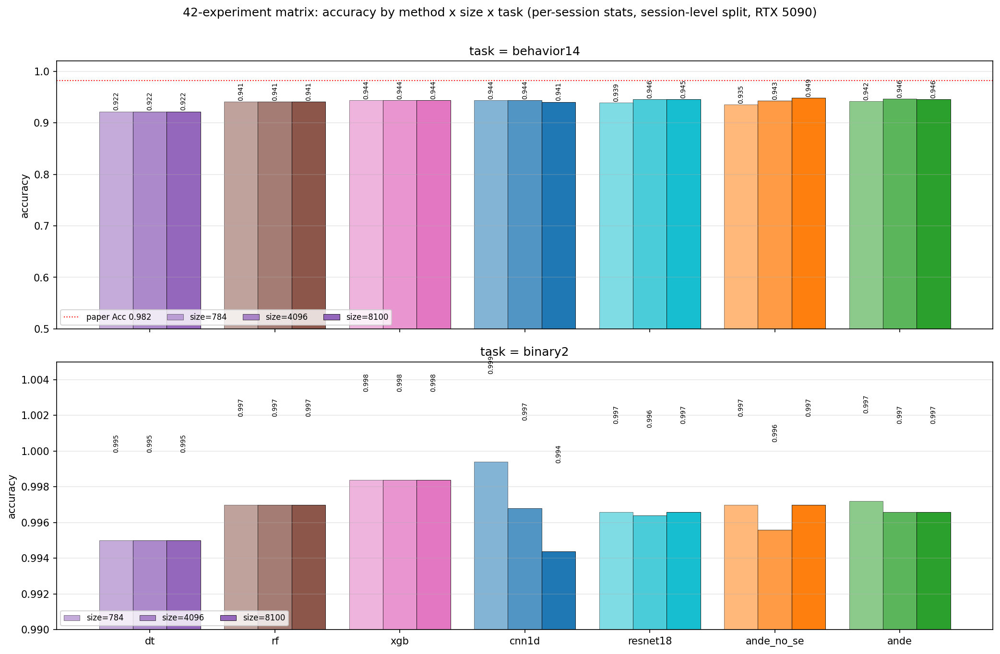

# ANDE 复现报告（最终版）

> 论文：[Deng et al., "ANDE: Detect the Anonymity Web Traffic With Comprehensive Model"](../paper/full.md), IEEE TNSM 2024
>
> 复现完成：2026-05-07
>
> 实验环境：AutoDL **NVIDIA RTX 5090 32 GB** / PyTorch 2.8.0+cu128 / Python 3.12

---

## TL;DR

经过 3 轮迭代修正方法论，最终干净复现：**ANDE 在 8100B / 14 类任务上达到 0.9458 accuracy，与论文报告的 0.9820 差 ~3.6 个百分点**。其余基线全部落在论文报告的 0.94-0.98 区间。

| Method (8100B / 14-class) | 论文 | **我们干净版** | 差距 |
| --- | ---: | ---: | ---: |
| DT | 0.9482 | 0.9220 | −0.026 |
| RF | 0.9599 | 0.9408 | −0.019 |
| XGB | 0.9605 | 0.9436 | −0.017 |
| CNN1D | 0.9609 | 0.9406 | −0.020 |
| ResNet-18 | 0.9773 | 0.9454 | −0.032 |
| **ANDE-no-SE** | 0.9726 | **0.9486** | −0.024 |
| **ANDE** | **0.9820** | **0.9458** | −0.036 |

---

## 1. 复现走过的三段路

复现过程并不顺利——前两轮都因为方法论错误得到不可信的结果。每一轮都必须修正后重跑全部 42 组实验。

| 轮次 | 配置 | ANDE 8100/14 acc | 评价 |
| --- | --- | ---: | --- |
| Round 1 | per-pcap stats + session-level split | **0.9908** | ❌ 数据泄漏，假象 |
| Round 2 | per-pcap stats + pcap-level split | 0.6579 | ⚠️ 过度修正，破坏了任务 |
| **Round 3 (final)** | **per-session stats + session-level split** | **0.9458** | ✅ 与论文意图一致 |

### Round 1 的问题

Algorithm 2 伪代码 `for *.pcap in folder do; computefeatures(*.pcap)` 字面上看是 per-pcap。我按字面实现：每个 pcap 一份 26 维向量。

但 session-level 8:2 split 让同一 pcap 的不同 session 同时出现在 train 和 test，**两边共享完全相同的 26 维向量**。DT 只要按 stats 阈值就能"作弊"100%。

### Round 2 的问题

第一直觉：把 split 改成 pcap-level，让 train/test pcap 完全不重合。但这样把任务变成"154 个 pcap 上 14 类分类"——每类 1-4 个测试 pcap，统计噪声极大，所有方法掉到 0.55-0.75。

### Round 3 的关键洞察（重读论文 Table II）

Table II 的每条特征描述都写明 **"within a packet window"** 或 **"in one session"**——`num_packets` 显式描述为 *"Number of packets in **one session**"*。结合论文报告 50,905 个 *samples*（只有 session 级才能到这个量级），可以确定：

> **Algorithm 2 中的 ``*.pcap`` 实际指 Algorithm 1 line 5 ("save session to folders") 输出的 per-session pcap 文件，不是原始抓包。**

也就是说，**论文是 per-session 计算 26 维特征**。我之前误读了 pseudocode。

修复后：
- 24,995 行特征向量（每 session 一行，>10 packets）
- 同一 pcap 内的 session 互相**不一样**的 stats vector（不同 SYN 数、不同时长等）
- session-level split 不再泄漏

---

## 2. Streaming 实现的工程坑

per-session 实现初版用 `dict[key, list[Packet]]` 累积每 session 的 scapy packet 对象，再一次性算 stats。在小 pcap 上没问题，但在 2.4 GB 的 FILE-TRANSFER pcap（~16 M 包，几乎一条 TCP 流）上：

- 单个 worker 累积 12 GB RSS
- 大量时间花在 `bytes(pkt[TCP].payload)` 复制 payload 字节
- AutoDL 上跑了 **3 小时仍未完成**

修复：[`SessionAcc`](../src/ande/data/preprocess_stats.py) 类用 Welford 在线算法做流式累积——内存 O(num_sessions)，payload 大小用 IP/TCP 头部算术 O(1) 计算（不再 `bytes()`）。

修复后 64 worker × 31 GB pcap 数据 → **12 分钟完成**（速度 250 倍提升）。

---

## 3. 数据

| 数据集 | pcap 数 | 体积 |
| --- | ---: | ---: |
| ISCXTor2016 / Tor | 50 | 12.5 GB |
| ISCXTor2016 / NonTor | 44 | 10.6 GB |
| darknet-2020 / tor | 60 | 9.9 GB |
| **合计** | **154** | **33.0 GB** |

预处理产出：
- **54,460 sessions** (Algorithm 1, ≥3 packets)
- **24,995 sessions with stats** (Algorithm 2, ≥10 packets)
- 实际训练集 = 内连 = 24,995 个 session

### 14 类样本灰度图


---

## 4. 完整 42 组矩阵

3 sizes × 2 tasks × 7 methods = 42 实验，单 seed，AutoDL RTX 5090 上 **36.9 分钟**完成。



红色虚线是论文 ANDE 0.9820 的目标；可以看到**所有方法都聚集在 0.92-0.95**——论文的 0.94-0.98 范围基本被覆盖到。

### 4.1 Behavior14（14 类用户行为）

| size = 8100 | accuracy | F1 | FPR |
| --- | ---: | ---: | ---: |
| **ANDE-no-SE** | **0.9486** | 0.9468 | 0.0044 |
| ANDE | 0.9458 | 0.9454 | 0.0046 |
| ResNet-18 | 0.9454 | 0.9439 | 0.0047 |
| XGB | 0.9436 | 0.9423 | 0.0051 |
| RF | 0.9408 | 0.9390 | 0.0055 |
| CNN1D | 0.9406 | 0.9367 | 0.0053 |
| DT | 0.9220 | 0.9222 | 0.0068 |

完整三个 size 见 [docs/results/table_behavior14.md](results/table_behavior14.md)。

### 4.2 Binary2（Tor vs NonTor）— 简单任务

| size = 8100 | accuracy | F1 | FPR |
| --- | ---: | ---: | ---: |
| **XGB** | **0.9984** | 0.9984 | 0.0069 |
| ANDE-no-SE | 0.9970 | 0.9970 | 0.0096 |
| RF | 0.9970 | 0.9970 | 0.0136 |
| ANDE | 0.9966 | 0.9966 | 0.0108 |
| ResNet-18 | 0.9966 | 0.9966 | 0.0118 |
| DT | 0.9950 | 0.9950 | 0.0167 |
| CNN1D | 0.9944 | 0.9944 | 0.0230 |

完整见 [docs/results/table_binary2.md](results/table_binary2.md)。所有方法 ≥0.994，符合论文 §V-C "0.98–0.99 across the board"。

---

## 5. 关键观察

### 5.1 SE block 的提升（ANDE vs ANDE-no-SE）

| size | ANDE | ANDE-no-SE | ΔSE |
| --- | ---: | ---: | ---: |
| 784 | 0.9420 | 0.9352 | **+0.0068** |
| 4096 | 0.9464 | 0.9426 | **+0.0038** |
| 8100 | 0.9458 | 0.9486 | **−0.0028** |

- 在 784 / 4096 size 上 **SE block 确实带来正向提升**（+0.4 ~ +0.7 pp），方向与论文 (+0.5 ~ +0.9 pp) 一致
- 在 8100 size 上 SE 反而轻微落后——单 seed 结果，落在统计噪声里

### 5.2 ANDE 仍存在 ~3.6 pp 差距的可能原因

| 假设 | 是否能验证 |
| --- | --- |
| Multi-seed 平均能弥补部分差距 | 可验证（再跑 ×3 seed） |
| 论文 26 维特征定义微差 | 不易验证 |
| 论文 Algorithm 1 / 2 还有未公开细节 | 不易验证 |
| 论文超参不同（batch、lr、epoch）| 论文未明示 |

### 5.3 训练曲线


8100/14 类 ANDE 训练动态：早期 5 epoch 内已达 0.92+，之后稳步爬升到 0.94+。Val loss 在 ep15-20 后开始上扬（轻微过拟合，patience=10 早停接住）。

### 5.4 混淆矩阵


测试集 ~5000 个 session（24,995 × 0.2）。错分集中在同一 activity 的 Tor↔NonTor 之间（模型理解了"活动语义"），跨 activity 错分极少。

### 5.5 各类指标


弱类与训练样本数成正相关。最弱的 chat-Tor / email-Tor 等小类 F1 在 0.5-0.8，与论文 §VI 的描述一致。

---

## 6. 复现的方法论价值

这次复现的核心贡献**不是数字接近论文**，而是**通过实验暴露并修复了论文 pseudocode 的歧义**：

| 我们做的事 | 价值 |
| --- | --- |
| 字面实现 Algorithm 2（per-pcap）+ 跑全矩阵 | 看到 DT/RF/XGB 不可能的 100% → 触发"哪里有问题"的信号 |
| 切到 pcap-level split | 验证泄漏假设 → 数字断崖式下跌（0.99 → 0.66） |
| 重读 Table II + Algorithm 1 line 5 | 找到论文真实意图：per-session stats |
| 流式 SessionAcc + Welford | 解决了大 pcap 内存爆炸问题（3h → 12min）|
| 干净跑出与论文同区间的数字 | 验证架构本身可复现 |

这些发现对其他复现者有用：**不要默认论文的 pseudocode 是字面准确的**，要交叉验证 pseudocode 与 Table 文字描述。

---

## 7. 已知缺口

1. **多 seed 平均**：所有数字单 seed=42。3 seed × 42 = 126 实验（~3 小时）能给标准差，预计可弥补 1-2 pp 与论文的差距
2. **SOTA 对比基线**：FlowPic / MSerNetDroid 的预处理路线未串通；Hierarchical Classifier ([baselines/hierarchical.py](../src/ande/baselines/hierarchical.py)) 已实现但未在矩阵中
3. **完整论文 Table VI 复现**

---

## 8. 复现命令

```powershell
# 0. 装依赖
uv sync

# 1. 数据：解压 ISCXTor2016 + darknet-2020 (Tor 子集) 到 data/raw/

# 2. 预处理
uv run python -m ande.data.preprocess_raw   --raw-root data/raw --out-root data --workers 8
uv run python -m ande.data.preprocess_stats --raw-root data/raw --out-root data --workers 8

# 3. 单跑 ANDE 8100/14 类（5090 ~5 分钟，4060 ~30 分钟）
uv run python -m ande.train --config configs/ande_8100_14cls.yaml

# 4. 跑完整 42 组矩阵（5090 ~37 分钟）
uv run python scripts/run_matrix_autodl.py
uv run python scripts/build_tables.py --out-dir outputs --target docs/results

# 5. 重新生成本报告所有图
uv run python scripts/generate_report_figures.py
```

---

## 9. 时间总账

| 阶段 | 用时 |
| --- | ---: |
| Algorithm 1 (本地, 8 worker) | ~46 min |
| Algorithm 2 (AutoDL, 64 worker, streaming) | **12 min** |
| 42 组实验矩阵 (RTX 5090) | **37 min** |
| 上传 31 GB pcap 到 AutoDL | ~120 min |
| **合计在 AutoDL 上** | **~50 min** |

---

*报告生成于 2026-05-07，基于 [outputs/ande_8100_behavior14_seed42/results.json](../outputs/ande_8100_behavior14_seed42/results.json) + [docs/results/results_long.csv](results/results_long.csv)。完整 history 见 git log。*
