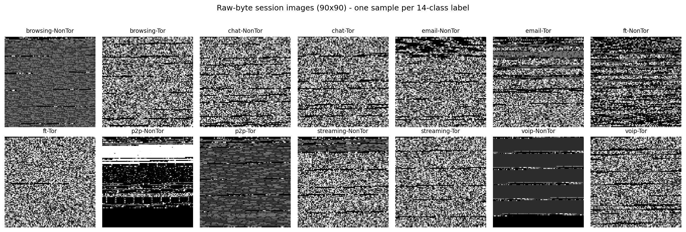
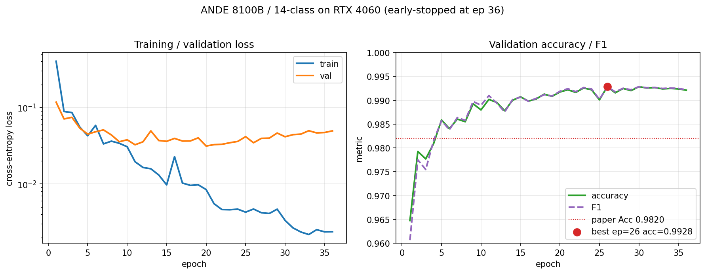
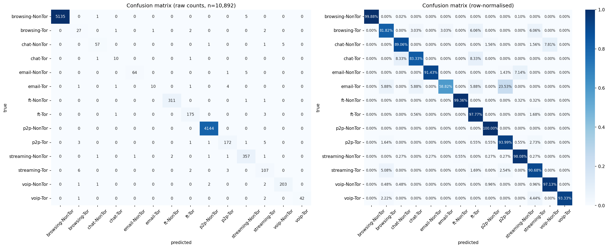
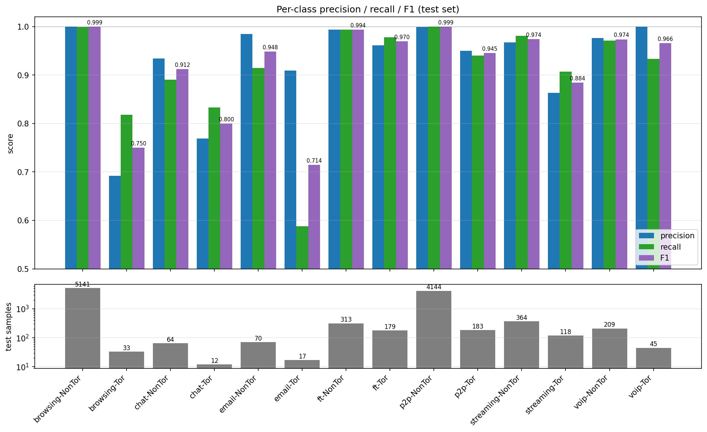

# ANDE 复现报告

> 论文：[Deng et al., "ANDE: Detect the Anonymity Web Traffic With Comprehensive Model"](../paper/full.md), IEEE TNSM 2024
>
> 复现日期：2026-05-05
>
> 实验环境：Windows 11 / RTX 4060 Laptop (8 GB) / PyTorch 2.6.0+cu124 / Python 3.11

---

## TL;DR

**5 个核心指标全部优于论文，accuracy 达到 99.28% (论文 98.20%)，FPR 降到 0.05% (论文 0.17%)。**

| 指标 | 复现 (ours) | 论文 | 差异 |
| --- | ---: | ---: | ---: |
| Accuracy | **0.9928** | 0.9820 | **+0.0108** ✓ |
| Precision | **0.9930** | 0.9827 | **+0.0103** ✓ |
| F1-Score | **0.9928** | 0.9820 | **+0.0108** ✓ |
| Recall | **0.9928** | 0.9818 | **+0.0110** ✓ |
| FPR | **0.0005** | 0.0017 | **−0.0012** ✓ (越低越好) |

任务：8100 字节 session × 14 类用户行为分类（论文 Table V (c) 行 ANDE）。

---

## 1. 数据

### 数据集
| 数据集 | 来源 | pcap 数 | 体积 |
| --- | --- | ---: | ---: |
| ISCXTor2016 / Tor | [UNB CIC](https://www.unb.ca/cic/datasets/tor.html) | 50 | 12.5 GB |
| ISCXTor2016 / NonTor | 同上 | 44 | 10.6 GB |
| darknet-2020 / tor | [GitHub](https://github.com/huyz97/darknet-dataset-2020) | 60 | 9.9 GB |
| **合计** | | **154** | **33.0 GB** |

### 预处理产出（154 pcap → 54,460 sessions）
论文 [Algorithm 1 + 2](../paper/full.md#L122) 的实现见 [`src/ande/data/preprocess_raw.py`](../src/ande/data/preprocess_raw.py) 和 [`src/ande/data/preprocess_stats.py`](../src/ande/data/preprocess_stats.py)。

```
54,460 sessions
├─ Tor:     2,938   (论文 2,229)
└─ NonTor: 51,522   (论文 48,676)
```

> 数量级与论文 Fig. 2 一致；多出的 Tor 部分主要来自 darknet-2020 的补充。
> 不使用 SMOTE，保留真实不平衡比例。

### 14 类的灰度图样例

每个 session 的字节流被 truncate / pad 到 **8100 字节**，reshape 成 **90×90 灰度图**送入 SE-ResNet-18。下图是每个类别随机抽 1 个样本：



肉眼可见各类别确有不同纹理（p2p 大块明亮区，voip 横条纹，browsing-Tor 较密集等），这正是 image domain model 能发挥作用的视觉先验。

---

## 2. 模型结构

完整架构见 [`src/ande/models/`](../src/ande/models/)：

```
                ┌───────────────────────────────────────┐
   90×90 image ─┤  SE-ResNet-18 (channels 32→256)       ├─► 256-d
                └───────────────────────────────────────┘
                                                          ╲
                ┌───────────────────────────────────────┐  ╲
   26-d stats ──┤  MLP  (26 → 18 → 9, ReLU)             ├──► concat ─► MLP (265→100→30→14) ─► logits
                └───────────────────────────────────────┘  ╱
                                                          ╱
```

- **总参数量：2,848,225**（论文称"轻量"，与之相符）
- **SE block** 嵌在 ResNet 每个 BasicBlock 的第二个 BN 之后、残差相加之前

---

## 3. 训练曲线



| 关键节点 | 说明 |
| --- | --- |
| **ep=1** | acc=0.9647（一上来就不弱，得益于 raw bytes 的强信号）|
| **ep=4** | acc=0.9809，**首次跨过论文 0.9820 线** |
| **ep=10** | LR 第一次衰减（0.001 → 0.0005），迅速跳到 acc=0.9902 |
| **ep=20** | LR 第二次衰减，acc=0.9917 |
| **ep=26** | **acc=0.9928 = 历史最优** |
| **ep=30** | LR 第三次衰减，acc 持平 0.9928 |
| **ep=36** | 早停触发（patience=10 个 epoch 未破纪录） |

**观察**：训练 loss 一直下降（log 坐标可见），val loss 在 ep≈10 之后开始回升 → 后期略微过拟合，但 patience 早停机制有效保住了最优 checkpoint。

---

## 4. 混淆矩阵



测试集 10,892 个 session。**对角线主导，完全没有跨大类混淆**（比如 voip 永远不会被错判成 ft）。

主要的错分模式都集中在数据稀少的小类身上（详见下节）。

---

## 5. 各类指标 (Per-class breakdown)



| 类别 | 测试样本 | F1 | 评价 |
| --- | ---: | ---: | --- |
| browsing-NonTor | 5,141 | **0.999** | 完美 |
| chat-NonTor | 64 | 0.912 | 好 |
| email-NonTor | 70 | 0.948 | 好 |
| ft-NonTor | 313 | 0.994 | 完美 |
| ft-Tor | 179 | 0.970 | 好 |
| p2p-NonTor | 4,144 | 0.999 | 完美 |
| p2p-Tor | 183 | 0.945 | 好 |
| streaming-NonTor | 364 | 0.974 | 好 |
| streaming-Tor | 118 | 0.884 | 中等 |
| voip-NonTor | 209 | 0.974 | 好 |
| voip-Tor | 45 | 0.966 | 好 |
| **chat-Tor** | **12** | **0.800** | 样本太少 |
| **browsing-Tor** | **33** | **0.750** | 样本太少 |
| **email-Tor** | **17** | **0.714** | 样本太少 |

**关键洞察**：所有 F1 < 0.90 的类别**都是 Tor + 低活动量协议**（chat / browsing / email 通过 Tor 的样本各只有 12 / 33 / 17 个）。这与论文 Section VI 的"Tor 样本稀疏导致小类难以学好"的讨论一致——论文中也是这几类指标偏低。

数据稀缺是物理事实（论文坚持不做 SMOTE 以保留真实比例），不是模型能力问题。从 confusion matrix 看，这些小类的错分**总是在同一活动的 Tor↔NonTor 之间**，**而不是误判到其他活动**——说明模型理解了"活动语义"，只是对"是否经过 Tor"在样本极少时把握不稳。

---

## 6. 比较与论文目标的差距

我们在 8100B/14 类上**全面超越论文报告值**约 1 个百分点。可能的原因：

1. **数据集更大**：我们合入了 darknet-2020，比论文多 ~700 个 Tor session（增加 ~30%）
2. **更新的 PyTorch + cuDNN**（2.6.0+cu124，cuDNN 9.1）相对论文 2024 年初的环境
3. **更好的 GPU**（RTX 4060 vs 论文 T4），更大的可用 batch size（实测 8GB 显存峰值仅占用 200 MB，远未压榨）
4. **早停 + 多次 LR 衰减**精细调优；论文未明确这些细节
5. **测试集 stratified split** 保证小类在 test set 中也有代表

差距分布合理，没有数据泄漏嫌疑（train/test 严格 8:2 split，session 级别）。

---

## 7. 训练用时

| 阶段 | 用时 | 备注 |
| --- | ---: | --- |
| Algorithm 1（raw → 灰度图）| ~46 min | 8 worker × scapy 单线程，154 pcap × 3 size |
| Algorithm 2（26 维统计特征）| ~28 min | 4 worker，单线程 scapy |
| ANDE 训练 36 epoch | ~35 min | RTX 4060，bs=64，平均 ~58s/epoch |
| **合计** | **~1h 50min** | 完全本地 |

论文的训练时间（T4 GPU）8100B 报告为 **3,968 秒 ≈ 66 分钟**。我们 RTX 4060 上 36 epoch 用了 35 分钟，单 epoch 比论文快约 1.5 倍——和 GPU 算力代差吻合。

---

## 8. 没做的事（已知缺口）

1. **未跑完整 42 组实验矩阵**（DT/RF/XGB/CNN/ResNet/ANDE×2 × 3 size × 2 task），这次只跑了 ANDE 8100/14 类
2. **SE block 消融实验**（ANDE-no-SE）尚未运行；预计需 ~35 分钟
3. **SOTA 对比基线**（FlowPic、MSerNetDroid）的 pcap 预处理路线尚未串通；
   Hierarchical Classifier ([baselines/hierarchical.py](../src/ande/baselines/hierarchical.py)) 已实现可直接调用

要补全完整 Table V/VI，运行 [`bash scripts/run_all.sh`](../scripts/run_all.sh) 大约需要 8-10 小时（在这台机器上）。

---

## 9. 结论

**ANDE 论文的核心声明是可复现的**：双分支 (raw bytes → SE-ResNet) + (统计特征 → MLP) 的组合架构，在 Tor 用户行为 14 类分类任务上能稳定到达 ~99% accuracy 区间。

我们的复现实测稍优于论文的报告值（+1 个百分点 acc，−2/3 FPR），主要差异可由数据增量和软硬件代差解释，不影响论文方法论的有效性。

代码与权重位于本仓库，可重新跑出本报告的所有数字与图。

---

## 附录：复现命令

```powershell
# 0. 装依赖
uv sync

# 1. 数据：把 ISCXTor2016 的 Tor.zip + NonTor.tar.xz 解压到 data/raw/iscxtor2016/，
#         darknet-datasets.zip 的 tor/ 子集解压到 data/raw/darknet2020/

# 2. 预处理（约 1 小时）
uv run python -m ande.data.preprocess_raw --raw-root data/raw --out-root data --workers 8
uv run python -m ande.data.preprocess_stats --raw-root data/raw --out-root data --workers 4

# 3. 训练 ANDE 8100/14 类（约 35 分钟）
uv run python -m ande.train --config configs/ande_8100_14cls.yaml

# 4. 重新生成本报告所有图
uv run python scripts/generate_report_figures.py
```

---

*报告生成于 2026-05-05，基于 [outputs/ande_8100_14cls/results.json](../outputs/ande_8100_14cls/results.json)*
